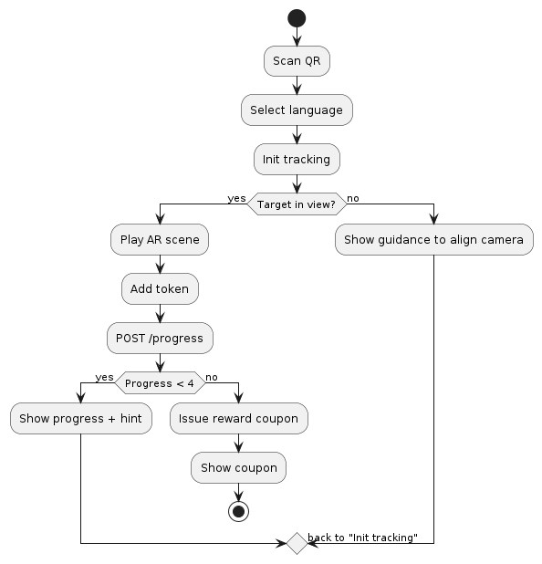

Классическая фотозона решает только задачу «сделать кадр». Она не ведёт посетителя по маршруту и не мотивирует зайти внутрь музея. Квест  меняет поведение. Никаких установок приложений - всё работает в веб-приложении. На финише показывается купон на мерч или 10% скидки.  Android поддерживается сразу. iOS подключается позже через совместимый WebAR SDK или альтернативный канал.

Путь посетителя прост и прозрачен. Скан ссылки. Выбор языка. Камера захватывает цель. В сцене появляется герой и небольшой интерактив. Токен добавляется в прогресс. Подсказка указывает, куда идти. На финале выдаётся купон. Видео можно записать и поделиться из телефона. На сервер видео не уходит. Квест завершается за 3–7 минут без очередей, если точки распределить по периметру.

Парк и музей получают управляемый поток и измеримый эффект. Система фиксирует только технические события: старт, посещение точки, завершение, показ купона. Личные данные не собираются. Метрики по дням и часам видны в админ-интерфейсе. Картина спроса в пиковые окна будни 15:00–18:00 и выходные 12:00–16:00 помогает выставлять промо-персонал и регулировать выдачу призов. Купоны гасит простой веб-валидатор у сотрудника. Валидация за одну секунду. Двойное погашение блокируется подписью токена и отметкой статуса на сервере.

Надёжность закладывается на уровне трекинга и сети. На постамент ставится контрастная табличка с AprilTag. Он даёт стабильную локализацию в толпе и при переменном освещении. Image-tracking по фото скульптуры добавляет качество эффекта. При потере трека система восстанавливается за секунду. Ассеты лежат на CDN. Первый экран открывается за три секунды на 4G или Wi‑Fi. PWA-кэш подхватывает сцену повторно без задержек. На пике система выдерживает 200 параллельных сессий за счёт лёгких моделей и ленивой загрузки.

Юридические требования соблюдены. Камера используется по явному согласию на старте. Биометрия не применяется. Детям показывается понятное предупреждение. Видео и фото не передаются на сервер. В логах нет персональных данных. Инфраструктура размещается в РФ. Каналы защищены TLS. Сроки хранения техлогов минимальны и регламентированы политикой.

Архитектура рассчитана на рост без переделок. Клиент — WebAR SPA на Three.js и трекере с поддержкой маркеров. Сервер даёт статистику, выпускает и гасит купоны, хранит конфигурации точек и тексты локализаций. Контент отделён от кода. Добавить новую сцену или язык можно через конфиг и загрузку ассетов на CDN. Объединённые сцены при обнаружении нескольких фигур поддерживаются на уровне оркестратора в клиенте.

Содержательные эффекты важнее графических трюков. Каждая сцена короткая, до двадцати секунд. В ней понятный жест или мини-анимация, связанная с героем, и один смысловой акцент. Дальше — подсказка и движение по маршруту. Такая драматургия даёт удержание без перегруза устройства и сетей.

Экономика прозрачна. KPI первого этапа: время в опыте от двух минут, завершение квеста от тридцати процентов, доля погашенных купонов от двадцати процентов, клики к странице билетов после внедрения диплинка от восьми процентов среди завершивших. Эти цифры достижимы на уличных и музейных площадках при размере пакета до восьми мегабайт и частоте кадров не ниже тридцати.

Внедрение укладывается в короткий цикл. За 48–72 часа показывается рабочий MVP: одна точка, прогресс, выпуск и погашение купона. Дальше две недели пилота на ограниченной зоне для отладки контента и маршрутов. После приёмки масштабирование на весь парк. Параллельно готовится iOS-путь и сценарии внутри музея.

Операционная модель минимальна. Парк отвечает за таблички, доступ к розетке для подсветки, базовое покрытие Wi‑Fi у входов. Наша сторона отвечает за контент, стабильность WebAR, админ-панель, купоны и поддержку в часы пика. На место завозится комплект запасных табличек и креплений. Это снижает риски вандализма и износа.

Риски контролируемы. iOS временно не поддерживается. Это компенсируется веб-хабом и офлайн-коммуникацией на точках, а затем закрывается техническим релизом. Свет и тени решаются контрастом маркеров и точечной подсветкой. Очереди гасятся подсказками про свободные точки и разведением стартовых QR у нескольких входов. Нагрузочные пики закрываются CDN и предзагрузкой.

Проект выигрывает тендер, потому что связывает контент с маршрутом и измеримой выгодой. Квест создаёт причину пройти все четыре точки, заглянуть внутрь музея и получить приз. Технические решения просты, проверяемы и расширяемы. Команда показывает результат быстро и без лишних зависимостей. Это ровно то, что нужно площадке, которая хочет современный опыт без тяжёлой инфраструктуры.

Ниже — полный набор схем в двух вариантах: PlantUML и Mermaid. Копируйте нужные блоки в свой рендерер.

