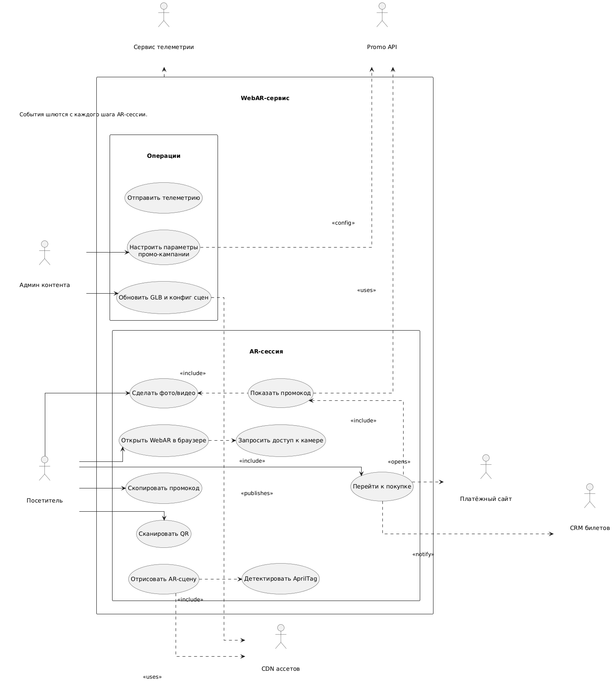
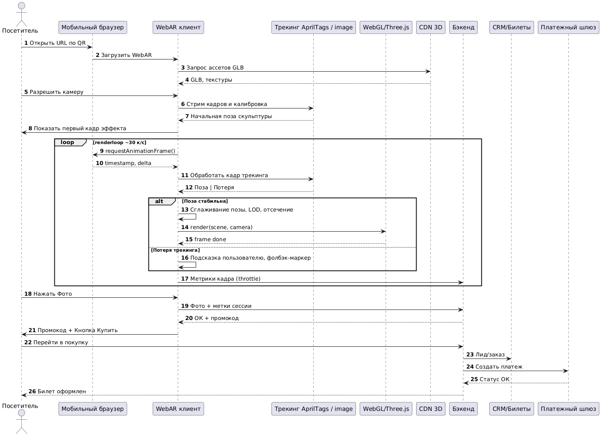
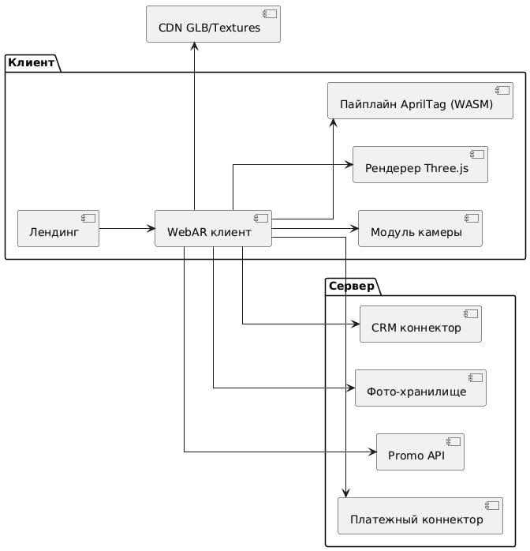
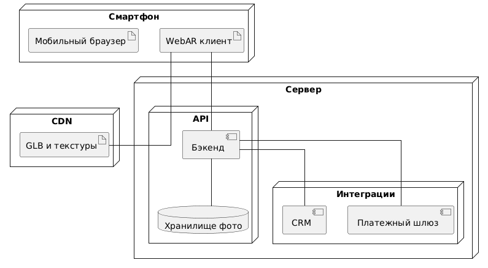
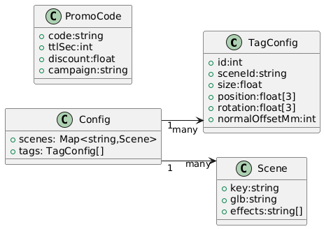
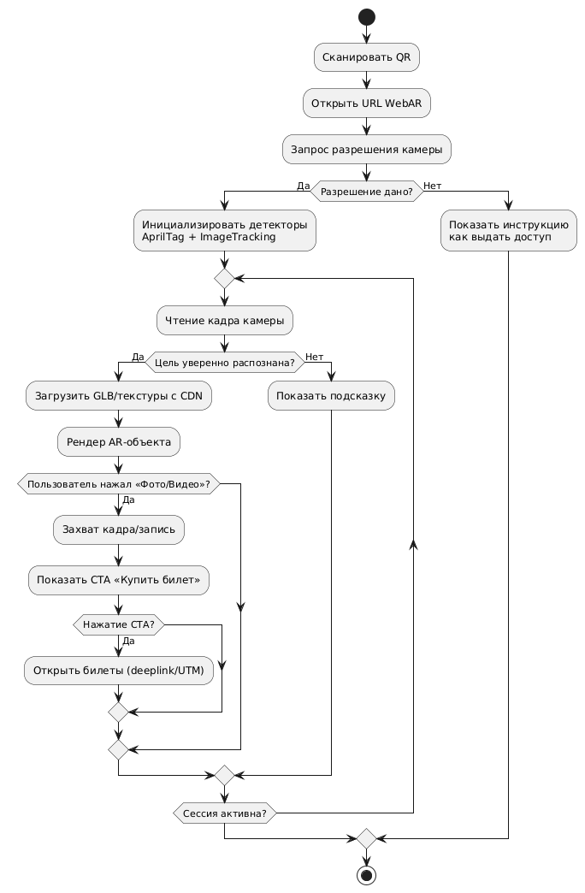
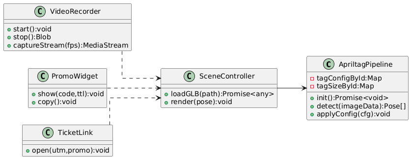

@page plan Бизнес план проекта

# 1. Резюме

Мы превращаем скульптуры СоюзмультПарка в точку продаж. Посетитель сканирует QR. В браузере запускается модуль для работы с дополненной реальностью. Камера распознает AprilTag, установленный у подножья скульптуры. Рядом с персонажем и человек появляются виртуальные объекты, наполняющие сцену динамикой и интересом к технологиям. Гость взаимодействует со сценой, после чего получает временный промокод на приобретение билета или мерча.

# 2. Бизнес-модель и эффект

Доходы. Продажи билетов и мерча после AR-сессии. Партнерские интеграции.
Ключевая механика. Временный промокод сразу после фото. Прямая конверсия из эмоции в чек.
Формула выручки после AR:
`Revenue = QR × p_cam × p_detect × p_photo × p_click × p_pay × AOV × (1 − discount)`.
Управление каждым множителем происходит засчёт настроек контента, скорости сцен и UI.

# 3. Пользовательский путь и случаи использования

Цель. Упростить переход от сканирования к покупке. Снять трение по разрешениям. Дать понятный шаг к билету.

# 4. Последовательность QR → AR → покупка

Оптимизация. Загружаем лёгкий лендинг, запрашиваем камеру после клика. Подгружаем GLB по частям. Возвращаем промокод с сервера вместе с атрибуцией.

# 5. Продукт и архитектура

Требования. Запуск без установки. Время старта до 3 секунд на 4G. Технологии. WebGL и Three.js в браузере. Трекинг AprilTags и SLAM. Бэкенд выдает промокод и ведет сбор метрик.

# 6. Развертывание

Изоляция рисков. CDN рядом с парком. Бэкенд в облаке. Фото храним отдельно. Платежи и CRM по защищенным каналам.

# 7. Данные и аналитика

Мы собираем минимум. Сессия, устройство, скульптура, средний FPS, факт фото, показ промокода, клик, покупка. Эти поля закрывают расчет воронки и ROI.

Ключевые метрики.
p_cam раздача разрешения камеры. p_detect стабильность трекинга. p_photo факт фото. p_click CTR к покупке. p_pay конверсия в оплату. AOV средний чек. Время старта сцены. FPS. Uptime.

# 8. Процессы и UX

Мы ведем пользователя простыми шагами. Даем подсказки по свету. Держим один экран на один выбор. Фолбэк есть.

Стабильность трекинга управляется порогами дрожания и тайм-аутами.

# 9. Классы и интерфейсы фронтенда

<!-- # 9. План внедрения

Неделя 1. Подготовка моделей, 3D-печать меток, монтаж QR-кода для перехода на сервис.
Неделя 2. Веб-клиент, первая сцена, CDN, аналитика.
Неделя 3. Интеграция CRM и платежей, промокоды, A/B кнопок.
Неделя 4. Полевые тесты, обучение персонала, релиз.
Эксплуатация. Контентные апдейты, ротация промо, поддержка.

 -->

# 10. Тест-план

- Тестируемые ОС устройств:
    * Android
    * iOS
- Тестируемые браузеры:
    * Chrome
    * Safari
    * Yandex
    * Firefox
    * Microsoft Edge
- Условия:
    * яркое солнце
    * тень
    * сумерки
    * дистанции 1–4 м.
    * ракурсы фронт/¾/бок.
- Проверки:
    * FPS
    * стабильность детекта
    * валидность позы
    * качество фото/видео
    * корректность промокода
    ---
    ### При возможности дальнейшего взаимодействия
    * UTM и параметры promo на лендинге 
    * путь оплаты
    * нагрузка.

# 11. Риски и как мы их снимаем

### Слабый интернет. 
> - Кэш и CDN.
> - Отложенная подгрузка.
> - Старые смартфоны. 
> - LOD и упрощенные шейдеры.
### Потеря трекинга.
> - Порог дрожания.
> - Сглаживание перехода сцены при обнаружении маркера/перемещения камеры.
### Юридические вопросы
> - Ясное согласие в UI и срок хранения.
> - Засчёт использования AlvaAR разрабатываемый продукт работает под лицензией GPL-v3. 

# 12. Безопасность и приватность

Фото по согласию. Минимум персональных данных. Хранение фото ограниченное по сроку. Шифрование в транзите и в покое. Журналы доступа. Удаление по запросу.
